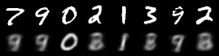
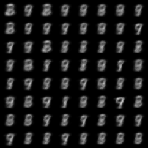
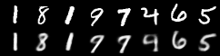
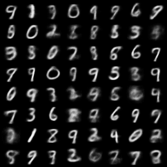
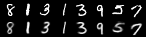
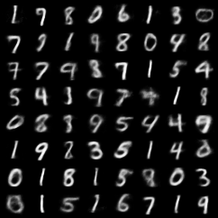
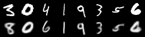
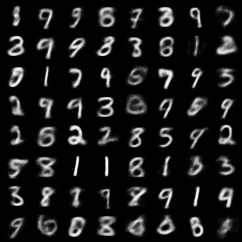

# Gumbel Softmax VAE

PyTorch implementation of a __Variational Autoencoder with Gumbel-Softmax Distribution__. 

*  Refer to the following paper: [Categorical Reparametrization with Gumbel-Softmax](https://arxiv.org/pdf/1611.01144.pdf) by Jang, Gu and Poole
* This implementation based on [dev4488's implementation](https://github.com/dev4488/VAE_gumble_softmax/blob/master/README.md) with the following modifications
  * Fixed KLD calculation
  * Fixed bug in calculating latent discrete probability
  * Fixed sampling distribution to get better images
  * Fixed training objective as the mean -ELBO in each batch which is consistent with [the author's implementation](https://github.com/ericjang/gumbel-softmax/blob/master/Categorical%20VAE.ipynb)
  * Refacted code for PyTorch 0.4.0 and cpu version


## Table of Contents
* [Installation](#installation)
* [Training](#train)
* [Results](#results)

## Installation

The program requires the following dependencies (easy to install using pip or Ananconda):

* python 3.6
* pytorch (version 0.4.0)
* numpy


### Training

```python
python gumbel_softmax_vae.py --log-interval 100 --epochs 100
```

## Results

Better training accuracy and sample image quality were obtained.

### Training output

```bash
Train Epoch: 1 [0/60000 (0%)]	Loss: 542.627869
Train Epoch: 1 [10000/60000 (17%)]	Loss: 210.317276
Train Epoch: 1 [20000/60000 (33%)]	Loss: 186.174133
Train Epoch: 1 [30000/60000 (50%)]	Loss: 194.145218
Train Epoch: 1 [40000/60000 (67%)]	Loss: 187.440338
Train Epoch: 1 [50000/60000 (83%)]	Loss: 186.376678
====> Epoch: 1 Average loss: 197.6736
====> Test set loss: 171.0257
Train Epoch: 2 [0/60000 (0%)]	Loss: 170.385742
Train Epoch: 2 [10000/60000 (17%)]	Loss: 162.513947
Train Epoch: 2 [20000/60000 (33%)]	Loss: 160.054916
Train Epoch: 2 [30000/60000 (50%)]	Loss: 158.194092
Train Epoch: 2 [40000/60000 (67%)]	Loss: 149.647385
Train Epoch: 2 [50000/60000 (83%)]	Loss: 144.748962
====> Epoch: 2 Average loss: 153.3126
====> Test set loss: 142.1215
Train Epoch: 3 [0/60000 (0%)]	Loss: 149.698944
Train Epoch: 3 [10000/60000 (17%)]	Loss: 140.085403
Train Epoch: 3 [20000/60000 (33%)]	Loss: 138.817505
Train Epoch: 3 [30000/60000 (50%)]	Loss: 136.967743
Train Epoch: 3 [40000/60000 (67%)]	Loss: 137.792786
Train Epoch: 3 [50000/60000 (83%)]	Loss: 134.401184
====> Epoch: 3 Average loss: 138.2995
====> Test set loss: 133.9106
```


### MNIST
| Training Step |  Ground Truth/Reconstructions   |    Generated Samples    |
| ------------- | :-----------------------------: | :---------------------: |
| 1             |   |   |
| 10            |  |  |
| 20            |  |  |
| 30            |  |  |